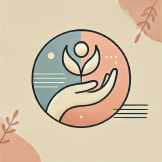
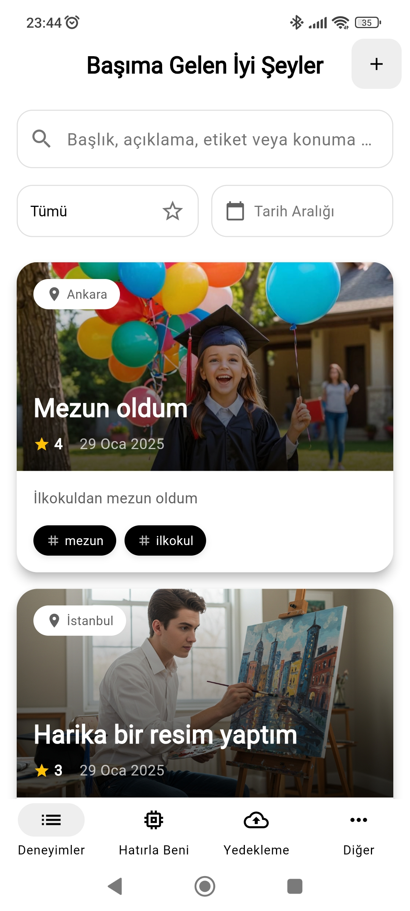
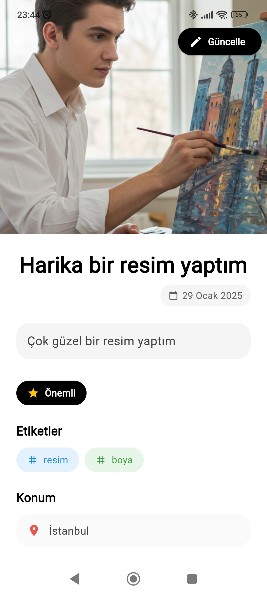
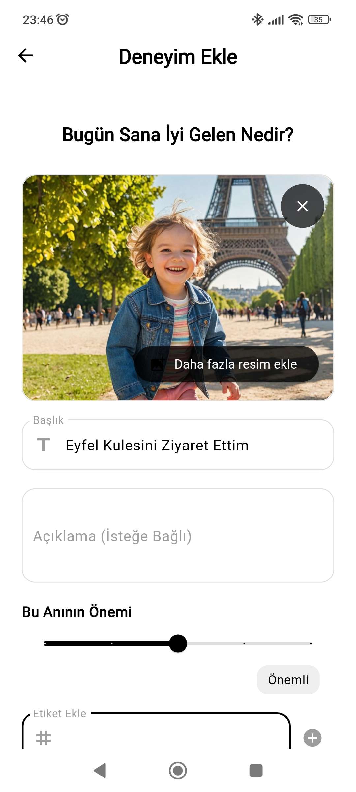
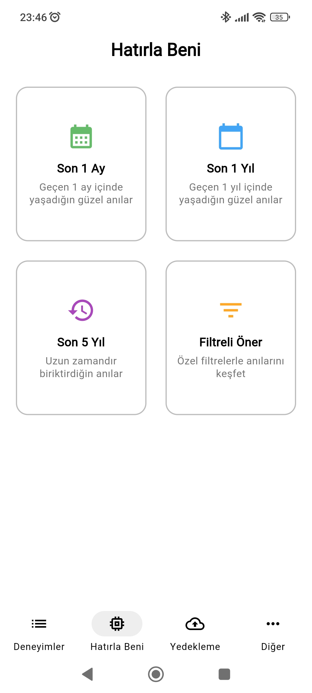
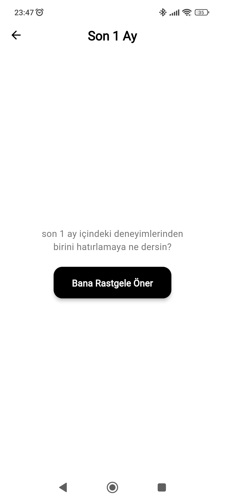

# Başıma Gelen İyi Şeyler App

<div align="center">
  
</div>

## 📱 Proje Hakkında

"Başıma Gelen İyi Şeyler" uygulaması, günlük hayatınızda başınıza gelen güzel olayları kaydetmenize ve bu anıları daha sonra tekrar hatırlamanıza olanak sağlayan bir mobil uygulamadır. Flutter framework'ü kullanılarak geliştirilmiş olan bu uygulama, kullanıcı dostu arayüzü ve modern tasarımı ile dikkat çekmektedir.

## 🌟 Özellikler

- 📝 Günlük güzel olayları kaydetme
- 🗂️ Kategorilere göre olayları sınıflandırma
- 📅 Tarih bazlı filtreleme
- 🔍 Geçmiş kayıtları arama
- 📊 İçe/Dışa aktarma
- 🌙 Karanlık/Aydınlık tema desteği
- 💾 Rastgele güzel olay öneri sistemi

## 🛠️ Kullanılan Teknolojiler

- Flutter
- Dart
- Clean Architecture
- Provider (State Management)
- Material Design

## 📥 Kurulum

1. Flutter'ı bilgisayarınıza kurun:
   ```bash
   https://flutter.dev/docs/get-started/install
   ```

2. Projeyi klonlayın:
   ```bash
   git clone https://github.com/mehmetkekec58/BasimaGelenIyiSeylerApp.git
   ```

3. Proje dizinine gidin:
   ```bash
   cd BasimaGelenIyiSeylerApp
   ```

4. Gerekli paketleri yükleyin:
   ```bash
   flutter pub get
   ```

5. Uygulamayı çalıştırın:
   ```bash
   flutter run
   ```

## 📱 Ekran Görüntüleri

<div style="display: flex; justify-content: space-between;">
  
  
  
  
</div>
<div style="display: flex; justify-content: space-around; margin-top:15px;">
  
  
</div>

---

⭐️ Bu projeyi beğendiyseniz yıldız vermeyi unutmayın! 